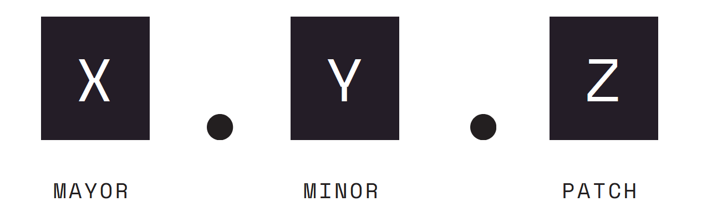

## Laboratorio Analisis y Diseño de Sistemas 1 - Sección P

# Proyecto - Fase 1

## Modelo de Branching

Un modelo de branching define la estrategia de la creacion de branches (ramas) en un repositorio de Git. Este determina cuándo y cómo los desarrolladores realizan cambios y los confirman de nuevo en el codigo fuente.

Para este proyecto se ha decidido utilizar el modelo de GitFlow.

GitFlow es un modelo de branching para Git creado por Vincent Driessen que utiliza dos ramas de larga duración: 'main' (a veces conocida como la 'master') y 'develop'. La rama main es su rama de producción. El código en esta rama debería ser el más estable.

De forma paralela existe la rama 'develop', esta rama es utilizada por los desarrolladores para integrar todos los cambios realizados al codigo fuente.

Sin embargo, estos cambios no son realizados en la rama develop, sino que se realizan en pequeñas bifurcaciones de la rama develop, llamadas 'features'. Estas rama features contienen codigo de nuevas características o revisiones que se hacen sobre la rama develop. Una vez la se ha concluido con el trabajo en una rama feature esta rama es fusionada (merged) con la rama develop.

Una vez se ha concluido con el trabajo de desarrollo se crea una rama 'release', esta rama es desplegada en un alojamiento temporal para realizar las ultimas pruebas (QA testig).

De encontrarse erroes en la rama release se procede a crear bifurcaciones llamadas 'bugfix', donde se corregiran errores dichos errores.

De estar todo en orden se hara un merge de la rama release a develop (para guardar los cambios realizados por bugfix) y a la rama main, para llevar el codigo a producción, en este punto se le agrega una tag a la rama main con su respectivo numero de versionamiento.

Si se detecta un error severo durante produccion se puede crear una rama llamada 'hotfix', estas ramas estan apartadas para corregir errores durante produccion que se fusionaran directamente a la rama main.


## Versionamiento

Para el proyecto se siguio el versionamiento semantico donde se registran los cambios en tres numeros:



### Patch

Por patches nos referimos a correccion de errores compatibles con versiones anteriores del programa, en este proyecto este numero subira luego de realizarse un 'hotfix'

```
version 1.0.0 // Version actual
version 1.0.1 // Version nueva luego de realizar un hotfix
```

### Minor

Este numero cambiara cuando en el codigo:

- Se realice una correccion de errores en release (bugfix)
- Se agregen nuevas funcionalidades (features)

Cabe recalcar que estos cambios al codigo fuente deben de ser compatibles con las versiones anteriores del programa.

```
version 1.0.5 // Version actual
version 1.1.0 // Version nueva luego de agregar features
```

Como se puede observar, una vez se realiza un minor se debera de reiniciar el contador de patch.

### Mayor

Indica que ha ocurrido un cambio drastico en el codigo fuente que hace esta version sea incompatible con versiones anteriores.

```
version 1.6.3 // Version actual
version 2.0.0 // Version nueva
```

Como se puede observar, una vez se realiza un mayor se debera de reiniciar el contador tanto de minor como de patch.
